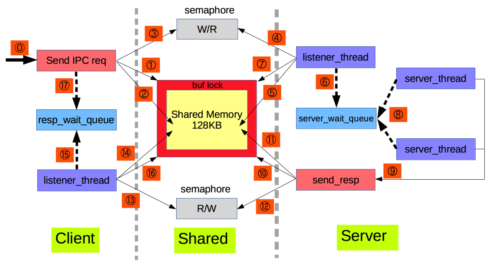

# Generic IPC

Generic IPC provides IPC(inter-process communication) infra for Linux platform applications. It’s based on system resources like semaphore, shared memory to support IPC functionality. For applications which adopt this infra, there should be only one client vs one server. And both client & server binary files should be put into the same directory. After that on running, a 2-way IPC is established between client & server process. Though there is role difference between client & server process, they can send IPC msg to each other in the same way.

## Architecture

Here is a overview of the whole architecture, when client sends IPC msg to server side & waits for response .

Each step is explained as below,

**\#0** Send IPC msg entry point.

**\#1** Acquire the buffer lock for the shared memory. Need to make sure to visit the memory zone exclusively.

**\#2** Now client thread can write the send data into the shared memory.

**\#3** After write done, notify server that there is data in shared memory to be dealt with. Then client would wait for the response from server side.

**\#4** On server side, there is always one listener thread monitoring the semaphore. Once it’s notified, listener would start to read data from shared memory.

**\#5** Server listener reads data from shared memory.

**\#6** Server listener enqueue the IPC data into a wait queue.

**\#7** Server listener releases the buffer lock.

**\#8** Two server threads are monitoring the wait queue. Once listener enqueue the data in step #6, they would be awaken, and pick up the IPC data to process it. The core API to handle IPC data is provided by application on init phase.

**\#9** After processing the IPC request data and making the response data, server thread would send back the response.

**\#10** - **\#12** Just like client sending phase from **#1** - **#3**  

**\#13** - **\#16** Just like server receiving phase from **#4** - **#7**

**\#17** Once there is new response entry put into the wait queue, client send thread would be awaken. It would then pick up the response belonging to itself, according to the sequence number, which is unique for each send loop.

## Pros vs Cons

###Pros
- 2-way IPC is provided
- A light weight IPC solution
- No central IPC server is needed
- Can send IPC request in parallel from both client & server side
- IPC speed is fast, since just exchange data in physical memory

### Cons
- There can only be one client vs one server
- Client & server binary should be put in the same directory

## How to use this Generic IPC?
There is already an example for client & server, in client.c and server.c. After make, run client & server binary, you can see how they exchange data from the log dumped on the console.
